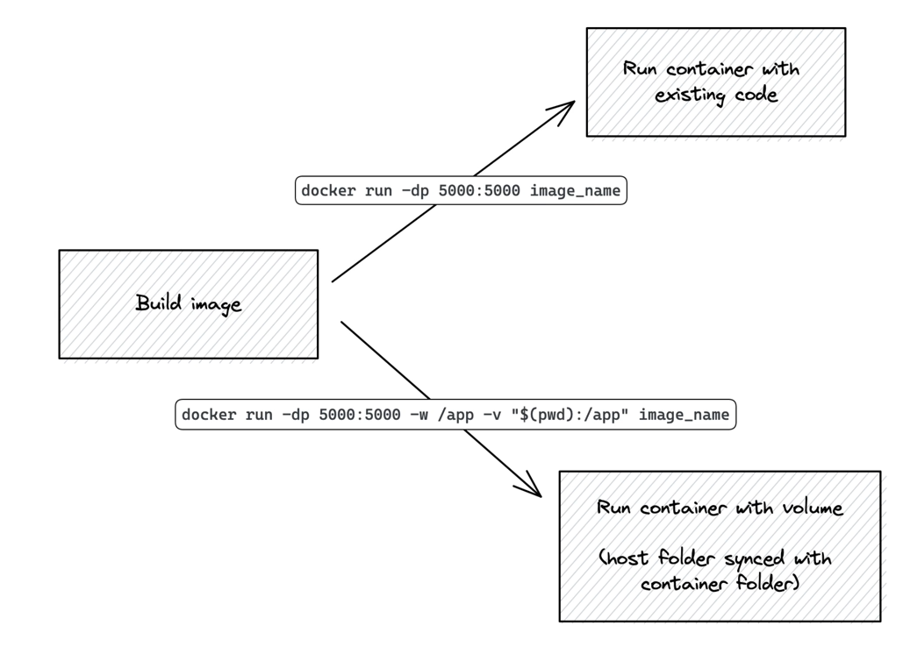

python3 -m venv venv
source venv/bin/activate
pip install -r requirements.txt

---

docker build -t flask-api .
docker run -dp 5005:5000 -w /app -v "$(pwd):/app" flask-api

---

-----

Aqui está o `README.md` no formato Markdown, gerado com base no projeto Python Flask.

# REST API com Flask, Flask-Smorest e Marshmallow

Uma API REST simples para gerenciar lojas e itens, construída com Python e Flask.

-----

## Sumário

  - [Tecnologias Utilizadas](https://www.google.com/search?q=%23tecnologias-utilizadas)
  - [Status](https://www.google.com/search?q=%23status)
  - [Descrição](https://www.google.com/search?q=%23descri%C3%A7%C3%A3o)
  - [Funcionalidades](https://www.google.com/search?q=%23funcionalidades)
  - [Documentação](https://www.google.com/search?q=%23documentacao)
  - [Autor](https://www.google.com/search?q=%23autor)

-----

## Tecnologias Utilizadas

\

\
\
\
\
\
\</div\>

-----

## Status

-----

## Descrição

Este projeto é uma API RESTful para cadastro e gerenciamento de lojas e itens. A aplicação utiliza **Flask** para o desenvolvimento das rotas e **Flask-Smorest** para abstração e organização do código com o uso de **Blueprints** e **MethodViews**. A validação e serialização de dados de entrada e saída são feitas com **Marshmallow**, garantindo a integridade dos dados e uma comunicação clara entre cliente e servidor.

-----

## Funcionalidades

  - **CRUD Completo:** Suporte a todas as operações (criar, ler, atualizar e deletar) para os recursos de `stores` e `items`.
  - **Validação de Dados:** Utilização de esquemas do Marshmallow para validar automaticamente as requisições, assegurando que os dados enviados estejam no formato e tipo corretos.
  - **Serialização de Respostas:** As respostas da API são serializadas de acordo com os esquemas, garantindo uma estrutura de dados consistente para o cliente.
  - **Estrutura Modular:** O código é organizado em Blueprints, separando as funcionalidades de lojas e itens em módulos distintos para facilitar a manutenção e escalabilidade.
  - **Suporte a Docker:** O projeto inclui um `Dockerfile` e comandos otimizados para desenvolvimento e execução em contêineres, garantindo um ambiente de execução consistente.
  - **Documentação Automática:** A integração com o Flask-Smorest gera documentação interativa da API (baseada em OpenAPI/Swagger) de forma automática.

-----

## Documentação

A API gera sua própria documentação interativa (Swagger UI). Para acessá-la, execute a aplicação e navegue até a rota `/swagger-ui` em seu navegador.

### Rotas Disponíveis

#### **Lojas (Stores)**

  - `GET /store`: Retorna a lista de todas as lojas cadastradas.
  - `GET /store/<string:store_id>`: Retorna os detalhes de uma loja específica.
  - `POST /store`: Cria uma nova loja.
  - `DELETE /store/<string:store_id>`: Deleta uma loja específica.

#### **Itens (Items)**

  - `GET /item`: Retorna a lista de todos os itens cadastrados.
  - `GET /item/<string:item_id>`: Retorna os detalhes de um item específico.
  - `POST /item`: Cria um novo item.
  - `PUT /item/<string:item_id>`: Atualiza um item existente.
  - `DELETE /item/<string:item_id>`: Deleta um item específico.

-----

## Autor

Desenvolvido por Diego Franco